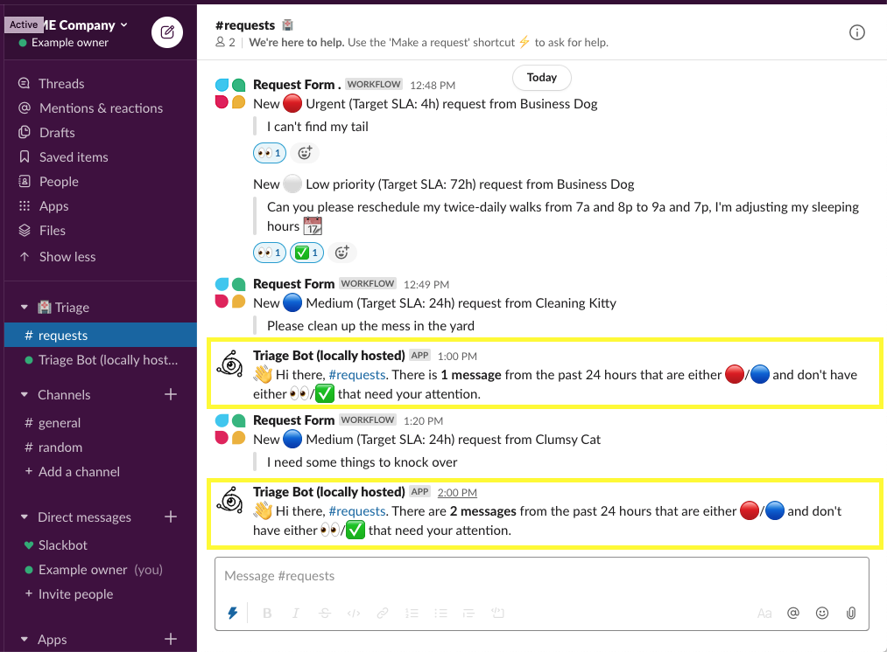
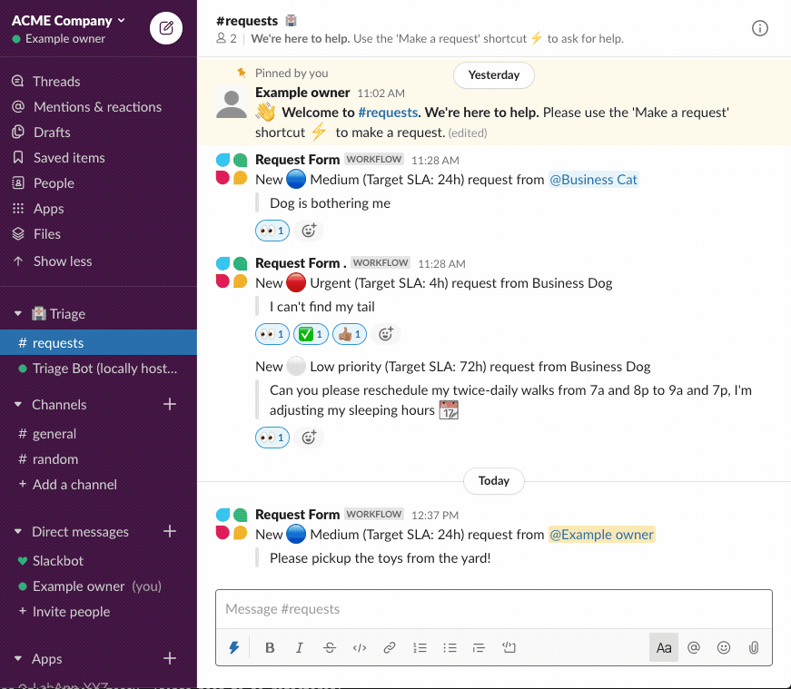
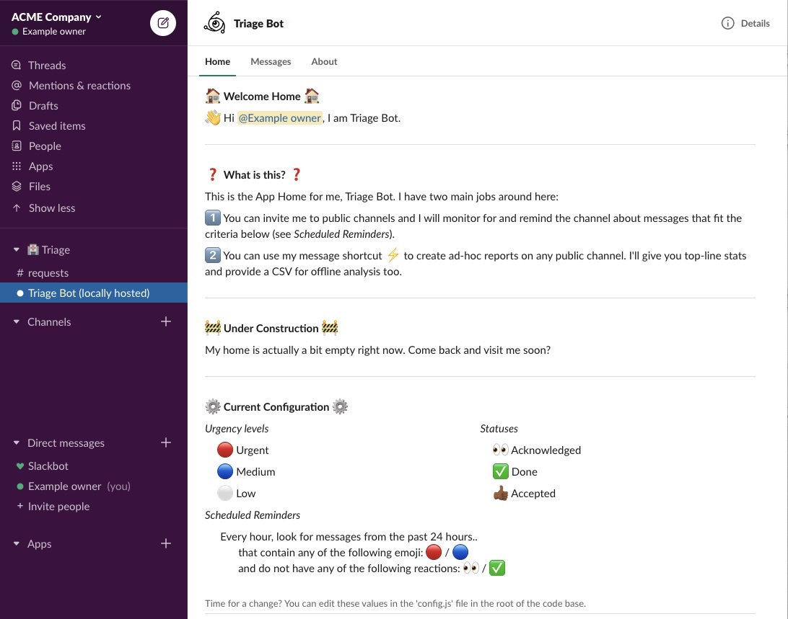

# Triage Bot and Channel Stats w/ Bolt for JS & Shortcuts ⚡️ 

## Overview

This repository implements a 'triage bot' that can help you analyze messages in a public channel to make sure requests are being looked at and resolved. [Learn more about what a triage channel is from Slack's help center here](https://slack.com/help/articles/360000384726-Prioritize-tasks-quickly-with-triage-channels).

This application has a few entry points and features to help you keep track of requests in public channels:

| Name and Description 	| Visual 	|
|------------------------	|------------------------------------------------------------------------------------------------------------------------------------------------------------------------------------------------------------------------------------------------------------------------------------------------------------------------------------------------------------------------------------------------------------------------------------------------------------------------------------------------------------------	|
| **1. Scheduled Reminders**   You can invite the bot to public channels and it will monitor for and remind the channel about messages that fit specific criteria on a scheduled basis.  All messages, except those posted by the app are counted, so this works great with [Slack's Workflow Builder](https://slack.com/slack-tips/quickly-field-requests-for-your-team) and any other monitoring integration that you use that uses the emojis you configure. 	|  	|
| **2. Ad-hoc Reporting**   You can use the global shortcut :zap: to create ad-hoc reports on any public channel. It'll give you top-line message counts by urgency and status and provide a CSV for offline analysis too.     <ol type="a"><li>Trigger the modal with a [global shortcut](https://slackhq.com/speed-up-work-with-apps-for-slack) and configure your report in the resulting modal</li><li>Triage stats bot will be added to the specified channel and run its analysis</li><li>Triage stats will be delivered to you in a DM from the bot</li></ol> 	|  |
| **3. View Configuration**   The app's [Slack App Home](https://api.slack.com/surfaces/tabs) offers users a view into the configuration of the application |  | 

## Steps to get your own app running:
- Head over to [`docs/SETUP.md`](docs/SETUP.md) for steps to get your app running on a traditional server or your laptop
- Check out [`docs/DEPLOY_Heroku.md`](docs/DEPLOY_Heroku.md) for instructions for deploying to Heroku, a platform-as-a-service, so you dont have to run anything locally.

## Additional documentation
Additional documentation is available in the `docs/` folder of this repository

## Credits and acknowledgements
- Built off of [Bolt (v2) + Shortcuts glitch](https://glitch.com/~slack-shortcuts-bolt)
- Slack Developer Relations / Tools team for `@slack/bolt`, `@slack/oauth`, and more
- O.G. [`triagebot-example` by @johnagan](https://github.com/johnagan/triagebot-example)
